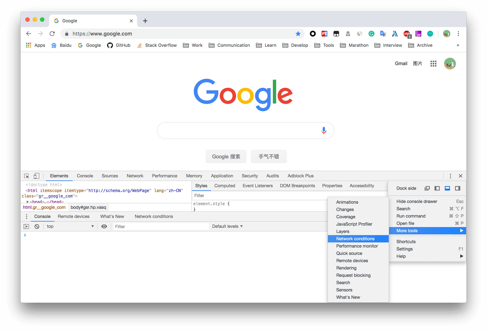
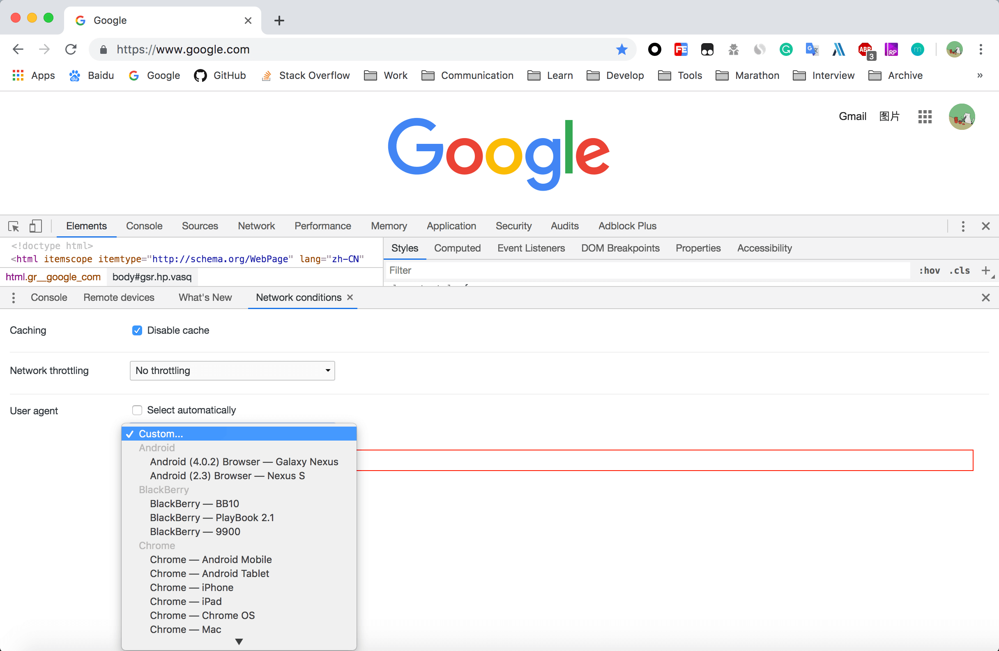

工作中，我们可能会发现某些网站在不同浏览器客户端上的表现不太一样，而这里主要判断的依据就是客户端的 User-Agent（后面简称 UA）。出于调试方便，我们会想是否有一个浏览器可以自定义修改 UA，从而达到伪装不同的客户端来访问同一网站的目的呢？答案就是万能的 Chrome。好了，废话不多说，下面就介绍两种方式来实现这个目的：

#### 0x01：通过在开发者工具里设置单一网站的访问 UA

* 0x001：打开 Chrome，访问需要调试的网站，调出开发者工具(Windows 上是 F12 或 Ctrl + Shift + I，Mac 上是 option +  command + I)；
* 0x002：点击三个竖点，选择 More tools —> Network conditions；
* 0x003：在 User agent 那一栏取消勾选 Select automatically，这里默认勾选代表访问网站时用的 Chrome 默认的 UA；
* 0x004：点击 Custom… 的下拉框选择要伪装的 UA，或者直接在下面的输入框里直接输入；
* 0x005：刷新页面(Windows 上是 F5 或 Ctrl + R，Mac 上是 command + R)，这时候 UA 已经是你改过的了，可以在 Console 里输入 navigator.userAgent 验证。
* 注意：这种方式修改只能在当前 tab 生效，新建 tab 时仍旧是默认 UA。

#### 0x02：通过使用扩展插件全局修改 UA

* 0x01：下载 Chrome 插件：[User-Agent Switcher and Manager](https://chrome.google.com/webstore/detail/user-agent-switcher-and-m/bhchdcejhohfmigjafbampogmaanbfkg)；
* 0x02：选择浏览器和操作系统，点击 Apply，这么设置后浏览器访问任何网站就都是用你设置的 UA 了。

> 参考链接

* [Chrome 快捷键参考](https://developers.google.com/web/tools/chrome-devtools/shortcuts?hl=zh-cn)

* [How To Change User Agent in Google Chrome](https://winaero.com/blog/change-user-agent-chrome/)

* [Chrome浏览器怎么修改user-agent伪装其它浏览器](https://jingyan.baidu.com/article/20095761d41761cb0621b46f.html)
